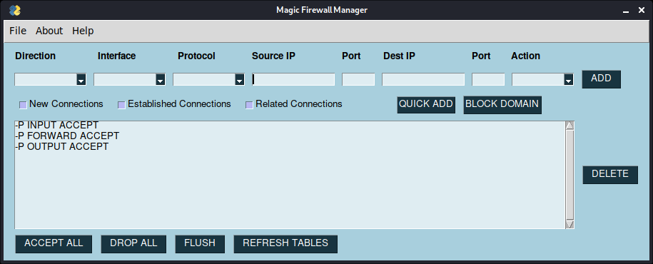

# magic-firewall-manager
Simple-to-use graphical user interface to add, delete, or modify firewall rules in Linux

This is a collaborative project that @ejdivi and I worked on for our final project in a Cyber Security course.
Neither of us have written a GUI prior to this and thought it would be a fun learning experience.


## Installation
This is just a script and requires no installation. Just download or copy the file and execute on the command line.   
```python:
sudo path-to-file/magic-firewall-editor.py
 -- or --
sudo python3 magic-firewall-editor.py
```

## Usage
The magic-firewall-manager utilizes the PySimpleGUI module and Python to provide a convenient way to modify iptables in Linux.
It creates command-line iptables commands and executes them through subprocess calls based on user-inputs in the GUI.   
Requires Python3



## Disclaimer
This tool is in no way intended to be used on production machines or servers.  
Rather, a fun and easy way to setup custom firewall rules without having to type them in manually.

The tool obviously requires sudo access to modify any firewall rules and can simply be executed on the command-line.

## Contribution
Pull requests are welcome.
Feel free to suggest edits, provide feedback, or use the tool for personal use.
